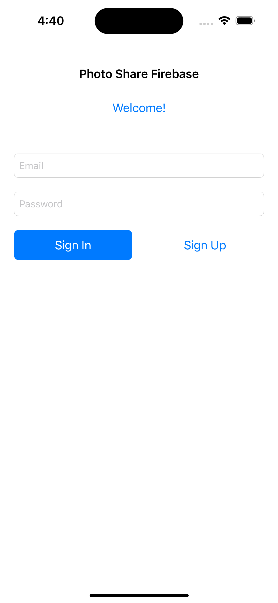

# Photo Share Swift With Firebase

## Configuration

### Firebase

First of all you need to create an firebase applicaton, you can find out how to create one on google. You need to get the GoogleService-Info.plist file from firebase and place it under the folder that has same name of the project. After that you need to initialize firestore, cloud storage and authentication with email and password.

## Installation

### Pods

Open a terminal,  go to the project root and execute pod install command.

## Screenshots

